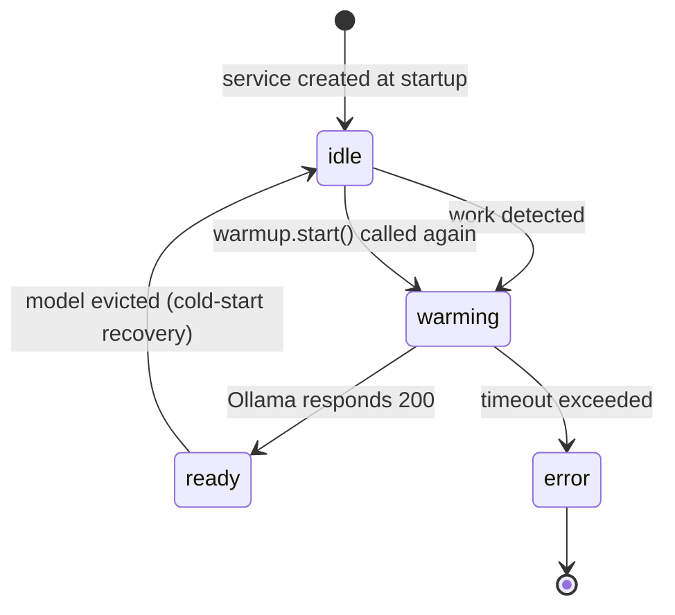
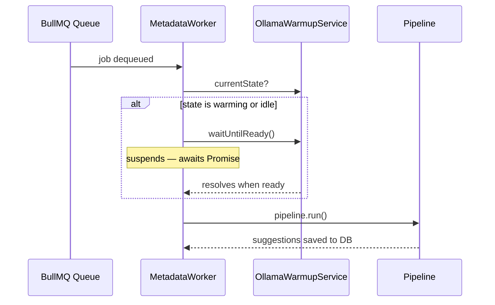
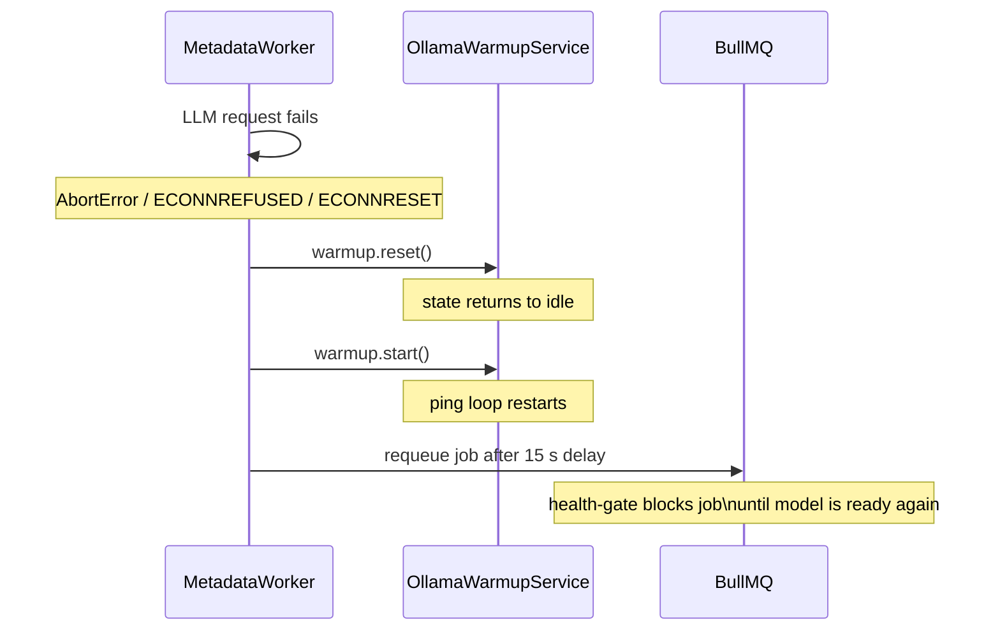

# Ollama Cold Start

When `LLM_PROVIDER=ollama`, Ollama needs to load the model into GPU or CPU memory before it can serve requests. This can take anywhere from a few seconds to several minutes depending on model size and hardware. If a processing job tries to call the LLM before the model is ready, the request fails.

paperless-llm handles this transparently so no jobs are lost and users get clear feedback.

---

## Overview

The solution has three layers:

1. **`OllamaWarmupService`** — sends a zero-token ping to Ollama and waits for it to respond successfully.
2. **Worker health-gate** — blocks any job from executing until the service reports `ready`.
3. **Cold-start recovery** — if Ollama evicts the model mid-run, the worker detects the failure, re-arms the warmup service, and requeues the job automatically.

---

## Warmup lifecycle



| State | Meaning |
|---|---|
| `idle` | No warmup attempted yet |
| `warming` | Ping loop active — model is loading |
| `ready` | Model is loaded; workers proceed normally |
| `error` | Warmup timed out; check Ollama logs |

Warmup is **lazy**: `start()` is only called when there is real work to do, so idle instances don't unnecessarily heat the model.

---

## Worker health-gate

Before executing any pipeline stage, the worker checks the warmup state. If Ollama is still warming, the job suspends in place and waits for the `ready` signal before continuing.



`waitUntilReady()` returns immediately when the state is already `ready`, so there is no overhead for jobs that arrive after the model is loaded.

---

## Cold-start recovery

Ollama can evict a model from memory between jobs (controlled by `OLLAMA_KEEP_ALIVE` on the Ollama server). If a job is already running when this happens, the LLM call gets an abort or connection error.



---

## UI feedback

Warmup state changes are pushed to the browser in real time via Server-Sent Events. The UI surfaces the state in several places:

| Location | When warming |
|---|---|
| Sidebar | Ollama indicator turns amber with a pulsing animation |
| Dashboard | System status shows "Warming up" with a spinning icon |
| Documents page | A banner appears: "LLM model loading into memory…" |

Toasts appear when the state transitions:

| Transition | Toast |
|---|---|
| `→ warming` | "LLM model loading into memory…" |
| `→ ready` | "LLM model ready" |
| `→ error` | "LLM model failed to load" |

---

## Configuration

| Variable | Default | Description |
|---|---|---|
| `OLLAMA_HOST` | `http://localhost:11434` | Ollama base URL |
| `LLM_MODEL` | — | Model name used for the zero-token warmup ping |
| `OLLAMA_REQUEST_TIMEOUT_SECONDS` | `600` | Both the per-request LLM timeout and the warmup timeout |

!!! tip "Reduce cold starts with OLLAMA_KEEP_ALIVE"
    Set `OLLAMA_KEEP_ALIVE=24h` on the Ollama server to keep the model in memory longer between jobs. This reduces cold starts at the cost of VRAM.

    ```yaml
    services:
      ollama:
        image: ollama/ollama:latest
        environment:
          OLLAMA_KEEP_ALIVE: 24h
    ```

---

## Troubleshooting

### "timed out waiting for llama runner to start"

This error comes from **Ollama's own scheduler**, not from paperless-llm. It means Ollama's internal `llama.cpp` runner didn't start within Ollama's own timeout. Increase the Ollama server's runner timeout or use a smaller model.

### Worker stays in `warming` state permanently

- Check that the model name in `LLM_MODEL` matches the model you pulled (`ollama list`).
- Verify Ollama is reachable at `OLLAMA_HOST`.
- Check Ollama container logs: `docker logs ollama`.

### Model keeps getting evicted

Increase `OLLAMA_KEEP_ALIVE` on the Ollama server. If VRAM is limited, consider using a quantized model (e.g. `llama3.2:3b-instruct-q4_K_M`).
