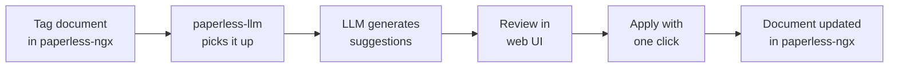

# paperless-llm

> Let AI organize your documents — so you don't have to.

**paperless-llm** is a companion service for [paperless-ngx](https://docs.paperless-ngx.com/) that uses a large language model (LLM) to automatically generate metadata suggestions for your documents — titles, tags, correspondents, document types, creation dates, and summaries. You review each suggestion in a clean web UI and apply it with a single click. Nothing is ever written back to paperless-ngx without your approval.

---

## How it works

1. Tag a document with `paperless-llm` in paperless-ngx.
2. paperless-llm polls for tagged documents and enqueues a processing job.
3. The document text is extracted (via OCR if needed) and sent to the configured LLM.
4. Suggestions are displayed in the web UI for review.
5. Accept, edit, or discard — then apply. paperless-ngx is updated instantly.

---

## Key features

| Feature | Details |
|---|---|
| **Multiple LLM backends** | OpenAI, Anthropic, Mistral, Google Gemini, or self-hosted Ollama |
| **Multiple OCR backends** | LLM Vision, Azure Document Intelligence, Google Document AI, or self-hosted Docling |
| **Review before apply** | All suggestions are staged — nothing is written back until you click Apply |
| **Customizable prompts** | Edit Handlebars templates in the UI; changes take effect immediately without a restart |
| **Auto-processing mode** | Bypass review and apply suggestions automatically via a separate tag |
| **Live job monitor** | Real-time progress via Server-Sent Events |
| **Bilingual UI** | English and German supported |

---

## Quick navigation

- :material-rocket-launch: **[Quickstart](getting-started/quickstart.md)**  
  Up and running in five minutes.

- :material-cog: **[Configuration](getting-started/configuration.md)**  
  All environment variables explained.

- :material-file-document: **[Reviewing Documents](user-guide/documents.md)**  
  How to use the review UI.

- :material-brain: **[LLM Providers](providers/llm-providers.md)**  
  Connect OpenAI, Ollama, Anthropic, and more.

- :material-eye: **[OCR Providers](providers/ocr-providers.md)**  
  Extract text from scanned documents.

- :material-variable: **[Environment Variables](reference/environment-variables.md)**  
  Complete reference for all settings.

