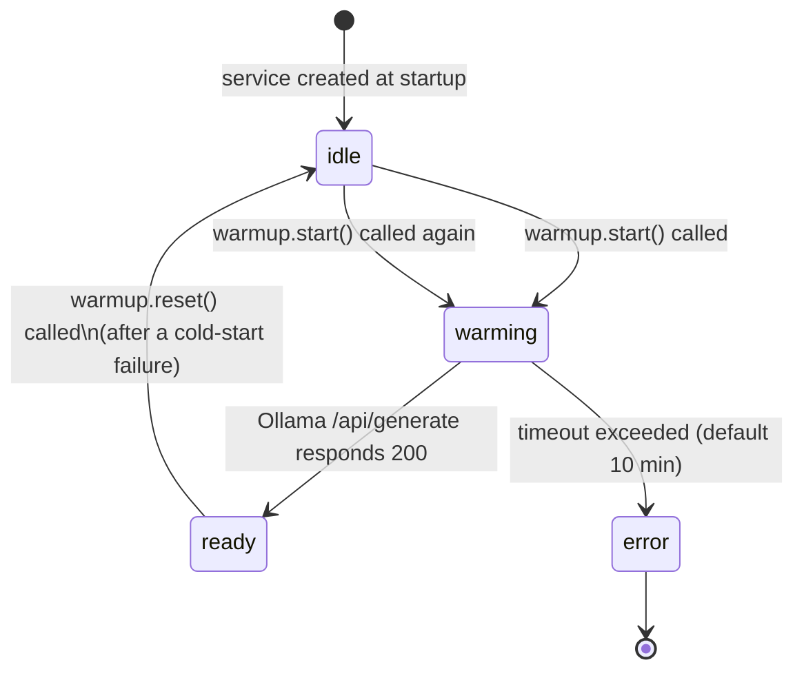
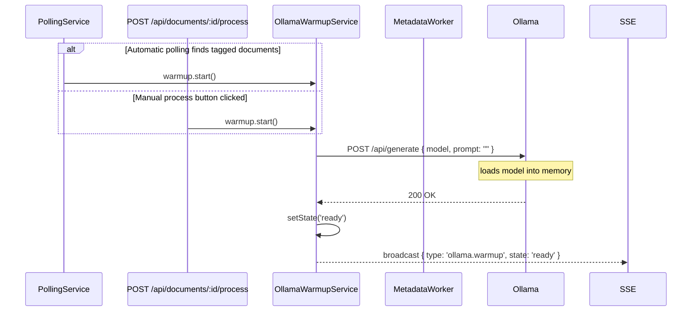
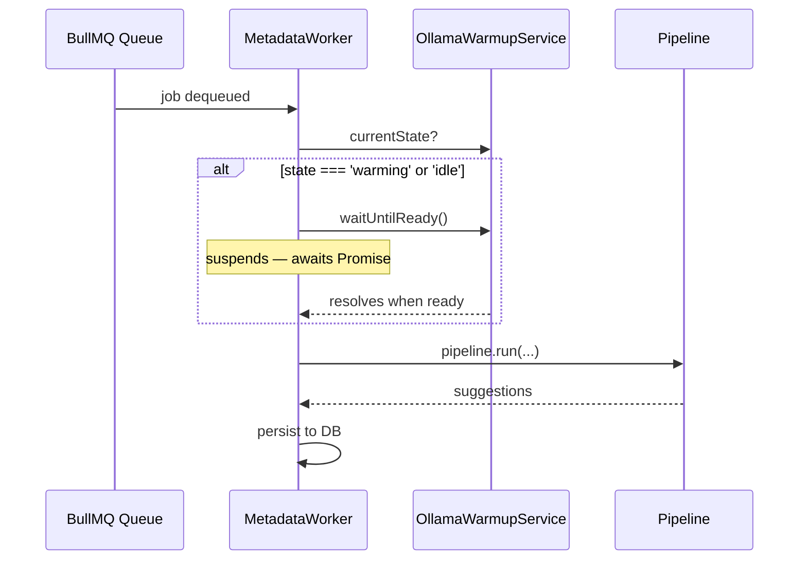

# Ollama Cold-Start Handling

When `LLM_PROVIDER=ollama` is configured, Ollama needs to load the model into GPU/CPU memory before it can serve requests. This load can take anywhere from a few seconds to several minutes depending on model size and hardware. If a job reaches the worker before the model is ready, Ollama returns an aborted or connection-reset error — a "cold start".

This document describes how paperless-llm handles this transparently so no jobs are lost and users get clear feedback.

---

## Overview

The solution has three layers:

1. **`OllamaWarmupService`** — owns the model-load lifecycle; sends a zero-token ping to Ollama and waits for it to respond successfully.
2. **Worker health-gate** — blocks any metadata job from executing until the service reports `ready`.
3. **Cold-start recovery** — if a job slips through (e.g. Ollama evicted the model mid-run), the worker detects the error, re-arms the service, and requeues the job after a short delay.

---

## Warmup Lifecycle



**States:**

| State | Meaning |
|-------|---------|
| `idle` | Service created, no warmup attempt yet (or reset after eviction) |
| `warming` | Ping loop active — Ollama is loading the model |
| `ready` | Ollama confirmed the model is loaded; workers proceed normally |
| `error` | Warmup timed out; jobs will fail until the issue is resolved |

---

## Trigger Points

Warmup is **lazy**: the service is created at startup but `start()` is only called when there is real work to do, to avoid heating the model when the application is idle.



---

## Worker Health-Gate

Before executing any pipeline stage, the worker checks the warmup state. If Ollama is still loading, the job waits in place rather than proceeding and failing.



`waitUntilReady()` returns immediately if the state is already `ready`, so there is zero overhead for jobs that arrive after the model is loaded.

---

## Cold-Start Recovery

Ollama can evict a model from memory between jobs (controlled by `OLLAMA_KEEP_ALIVE` on the Ollama server). If a job starts, sends an LLM request, and the model has been evicted, Ollama responds with an abort or connection error.

```mermaid
sequenceDiagram
    participant W as MetadataWorker
    participant WS as OllamaWarmupService
    participant BQ as BullMQ

    W->>W: pipeline.run() — LLM request fails
    note over W: AbortError / ECONNREFUSED / ECONNRESET

    W->>W: detect isColdStart = true
    W->>WS: warmup.reset()
    note over WS: state: ready → idle, new Promise created
    W->>WS: warmup.start()
    note over WS: state: idle → warming, ping loop restarts

    W->>BQ: job.retry() after 15 s delay
    note over BQ: job re-enters queue; worker\nhealth-gate blocks it until ready
```

**Cold-start error detection** matches:
- `err.name === 'AbortError'`
- `err.message` includes `aborted`
- `err.message` includes `ECONNREFUSED`
- `err.message` includes `ECONNRESET`

The 15-second requeue delay (`COLD_START_REQUEUE_DELAY_MS`) gives Ollama time to start loading before the job is picked up again.

---

## Health Endpoint

`GET /api/health` includes the warmup state when `LLM_PROVIDER=ollama`:

```json
{
  "status": "ok",
  "checks": {
    "paperlessNgx": true,
    "redis": true,
    "database": true,
    "ollama": true
  },
  "ollamaModel": "qwen3:14b",
  "ollamaWarmup": "warming"
}
```

`ollamaWarmup` mirrors the `WarmupState` type: `idle | warming | ready | error`. The field is absent when the provider is not Ollama.

---

## SSE Events

Warmup state changes are broadcast to all connected frontend clients via Server-Sent Events:

```json
{
  "type": "ollama.warmup",
  "payload": {
    "state": "warming",
    "model": "qwen3:14b"
  }
}
```

The frontend (`useJobSseUpdates`) listens for this event, invalidates the health query, and shows toast notifications:

| State | Toast |
|-------|-------|
| `warming` | ℹ️ "LLM model loading into memory…" |
| `ready` | ✅ "LLM model ready" |
| `error` | ❌ "LLM model failed to load" |

---

## Frontend Indicators

When `ollamaWarmup === 'warming'` the UI surfaces this in three places:

**Sidebar status indicator**
- The Ollama dot turns amber and pulses (`animate-pulse`)
- The sublabel changes from the model name to "Warming up"

**Dashboard stat card**
- The system status value changes to "Warming up"
- The icon becomes a spinning amber `Loader2`

**Documents page**
- A banner appears: "LLM model loading into memory…"
- Each waiting job's stage-progress spinner turns amber and shows "Warming up" instead of "Waiting"

---

## Configuration

| Environment variable | Default | Description |
|----------------------|---------|-------------|
| `LLM_PROVIDER` | — | Must be `ollama` for the warmup service to be created |
| `OLLAMA_HOST` | `http://localhost:11434` | Ollama base URL (the warmup service strips any `/api` suffix) |
| `LLM_MODEL` | — | Model name sent to `/api/generate` for the zero-token ping |
| `OLLAMA_REQUEST_TIMEOUT_SECONDS` | `600` | Also used as `warmupTimeoutMs`; controls how long the ping loop runs before giving up |

The warmup timeout mirrors `OLLAMA_REQUEST_TIMEOUT_SECONDS` so a single env var covers both the per-request LLM timeout and the total time allowed for a cold start.

> **Tip:** Control how long Ollama keeps the model in memory between jobs with the `OLLAMA_KEEP_ALIVE` environment variable on the Ollama server (e.g. `OLLAMA_KEEP_ALIVE=24h`). A longer keep-alive reduces cold starts at the cost of VRAM.

---

## Troubleshooting

### "timed out waiting for llama runner to start: context canceled"

```
time=… level=ERROR source=sched.go:571 msg="error loading llama server"
  error="timed out waiting for llama runner to start: context canceled"
```

This error comes from **Ollama's own internal scheduler** (`sched.go`), not from paperless-llm. It means Ollama gave up waiting for the `llama.cpp` runner subprocess to become ready before our warmup ping even got a response.

**Two separate timeouts are in play:**

```
paperless-llm warmup ping
│
▼  OLLAMA_REQUEST_TIMEOUT_SECONDS (default 600 s)   ← our app-level timeout
│
└──► Ollama /api/generate
       │
       ▼  OLLAMA_LOAD_TIMEOUT (default 5 m)          ← Ollama-internal timeout
          llama.cpp runner loading model…
```

If the model takes longer than `OLLAMA_LOAD_TIMEOUT` to load into memory, Ollama cancels the runner and returns an error. Our warmup service will retry after 5 seconds, but each retry triggers another load attempt that also hits the same wall.

**Fix:** Increase `OLLAMA_LOAD_TIMEOUT` in the Ollama container environment. The value accepts Go duration syntax.

```yaml
# docker-compose.yml — Ollama service
services:
  ollama:
    image: ollama/ollama
    environment:
      OLLAMA_LOAD_TIMEOUT: 10m   # increase from the 5 m default
```

Common values by model size:

| Model size | Suggested `OLLAMA_LOAD_TIMEOUT` |
|------------|--------------------------------|
| ≤ 7 B | `5m` (default) |
| 14 B | `10m` |
| 32 B | `15m` |
| ≥ 70 B | `30m` |

Also make sure `OLLAMA_REQUEST_TIMEOUT_SECONDS` in paperless-llm is **greater than** `OLLAMA_LOAD_TIMEOUT`, otherwise paperless-llm's own timeout fires first:

```env
# paperless-llm
OLLAMA_REQUEST_TIMEOUT_SECONDS=900  # 15 min — must exceed OLLAMA_LOAD_TIMEOUT
```
