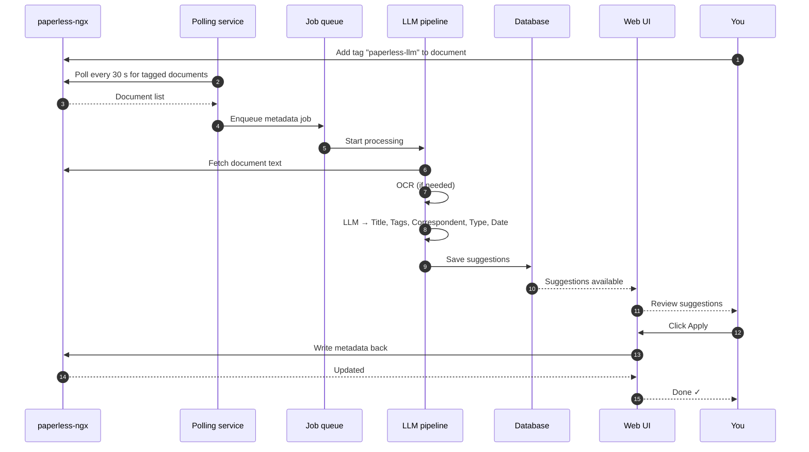

# How It Works

## The manual review workflow

The default workflow gives you full control. Nothing is written back to paperless-ngx until you explicitly click **Apply**.

---

## Pipeline stages

Each document goes through an ordered pipeline. Stages run sequentially, with later stages able to use the output of earlier ones.

| Stage | What it generates | Enabled by default |
|---|---|---|
| **OCR** | Raw text extraction from PDF images | Only when explicitly triggered |
| **Title** | A short, descriptive document title | Yes |
| **Tags** | Relevant tags from your paperless-ngx tag list | Yes |
| **Correspondent** | Sender or primary party name | Yes |
| **Document type** | Category from your document type list | Yes |
| **Created date** | ISO 8601 date extracted from content | Yes |
| **Summary** | 2–4 sentence document summary | Opt-in only |

!!! info "Summary stage"
    The Summary stage is never enabled by default. To generate a summary, either use the **Generate** button in the UI and select the Summary stage, or use the auto-analysis endpoint directly.

---

## Tags and their meanings

paperless-llm uses three tags to drive its workflow:

| Tag | Default name | Meaning |
|---|---|---|
| Manual tag | `paperless-llm` | Queue a document for manual review |
| Auto tag | `paperless-llm-auto` | Process and apply automatically, no review |
| Processed tag | `paperless-llm-processed` | Applied after suggestions are accepted; prevents re-processing |

You can rename all tags via environment variables (`MANUAL_TAG`, `AUTO_TAG`, `PROCESSED_TAG`).

---

## What happens when you apply suggestions

When you click **Apply** in the UI:

1. The LLM suggestions are written to paperless-ngx via its REST API.
2. The `paperless-llm` trigger tag is removed from the document.
3. The `paperless-llm-processed` tag is added.
4. The suggestion row in the local database is marked `applied`.

If you click **Discard**, the suggestion is marked `discarded` and the document remains tagged (you can regenerate later).

---

## Duplicate prevention

The polling service tracks which documents already have **pending suggestions** or **active jobs** and skips them automatically. This means:

- Tagging the same document twice doesn't create duplicate jobs.
- Already-reviewed documents (with `PROCESSED_TAG`) won't be re-queued.
